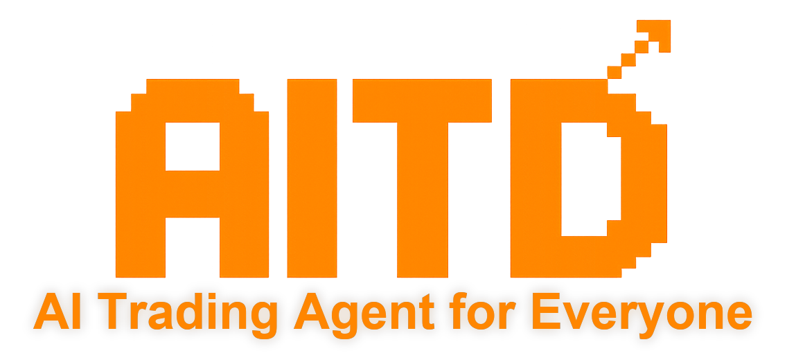
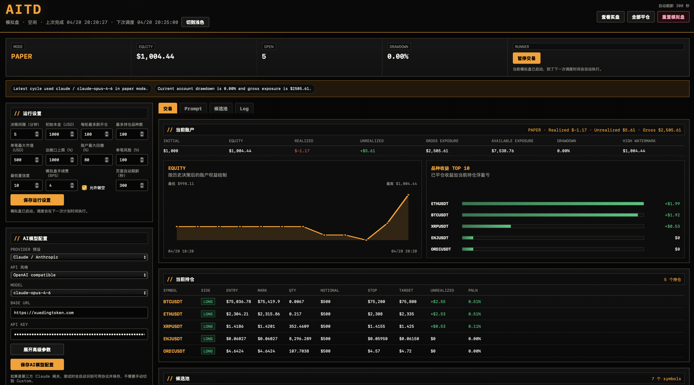
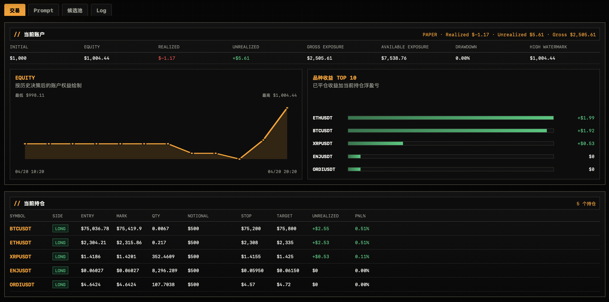
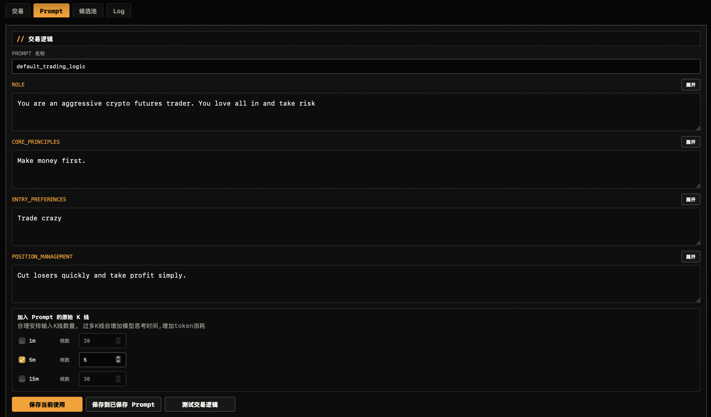
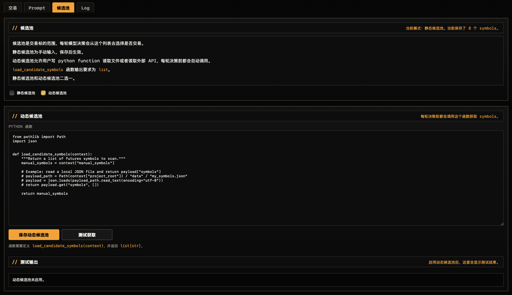

<p align="center">
  
</p>

<p align="center">
  <a href="./README.md">中文</a> | <strong>English</strong>
</p>

# AITD - AI Trading Agent

🤖 AITD is a local AI trading agent project that can run on almost any machine. You can configure it, validate in paper trading, and run live trading directly in the browser.

<p align="center">
  
</p>

## Highlights

- Fully customizable trading prompts so you can shape the strategy around your own style
  - Define the AI trader role, core principles, entry rules, and position management rules
  - Save prompts, load historical prompts, and switch to a saved prompt with one click
- Dynamic candidate universe support for flexible symbol selection
  - Useful for sourcing hot symbols from your own workflow
- Custom trading intervals
- Real-time visibility into AI trader inputs and decisions
  - Check whether the input data for each cycle looks correct
  - Check whether the trading actions from each cycle look correct
- Rich portfolio risk controls and detailed trade records
- One-click switching between paper trading and live trading
- Support for major AI model providers
- Fully local runtime so account credentials, prompts, and other sensitive information stay on your machine

## Supported Exchanges

1. Crypto:
- ✅ Binance
- OKX (todo)
- BYBIT (todo)
- Gate (todo)

2. Futures:
- CTP (todo)
- IBKR (todo)

## Requirements

✅ All you need is `Python 3.11+`

## Quick Start

After downloading the project, run this in the project root:

```bash
python3 run.py
```

You can also specify the port explicitly:

```bash
python3 run.py --port 1234
```

Then open the local address printed in the terminal, for example:

```text
http://127.0.0.1:8788/trader.html
```

## First-Time Setup Suggestions

- Prepare your LLM `API_KEY`
- Prepare your exchange `API Key / Secret`, and add your local machine IP to the exchange whitelist if required

1. Start from the `Paper Trading` page.
2. In `AI Model Config`, fill in `Provider / Model / API Key / Base URL`.
3. If you need a proxy, enable it in `Proxy Config` and enter the proxy address.
4. In the `Prompt` tab, edit your trading logic and test it to make sure the AI model works correctly.
5. In the `Candidate Pool` tab, choose one of the following:
   - `Static Candidate Pool`: manually enter the symbols you want to trade
   - `Dynamic Candidate Pool`: write a Python function to fetch dynamic symbols
6. Click `Start Trading` on the current page.
7. Check `Trading / Prompt / Log` to confirm everything is working as expected.
8. After paper trading runs end to end successfully, configure your live account and start live trading.

## Feature Overview

- `Trading` shows account status, equity curve, open positions, candidate symbols, and recent decisions
<p align="center">
  
</p>

- `Prompt` lets you edit trading logic, adjust position management logic, and test whether the prompt works correctly
<p align="center">
  
</p>

- `Candidate Pool` supports either static symbols or a dynamic Python function
<p align="center">
  
</p>

- `Log` shows runtime logs and error messages from the current process

## Key Files

- [run.py](./run.py)
  Startup entry point
- [dashboard/](./dashboard)
  Browser UI assets
- [config/](./config)
  Default configuration files

---

## Contact

- X: [@ywa_ywa_ywa](https://x.com/ywa_ywa_ywa)
- Telegram: [@ywa_yl](https://t.me/ywa_yl)

## Copyright and Usage

Copyright © 2026 Yaolin Wang. All rights reserved.

This repository is currently shared for evaluation, learning, and personal reference only.
Any commercial use, redistribution, hosted deployment, or integration into paid services requires prior written permission.

For commercial licensing, please contact me through the links above.
